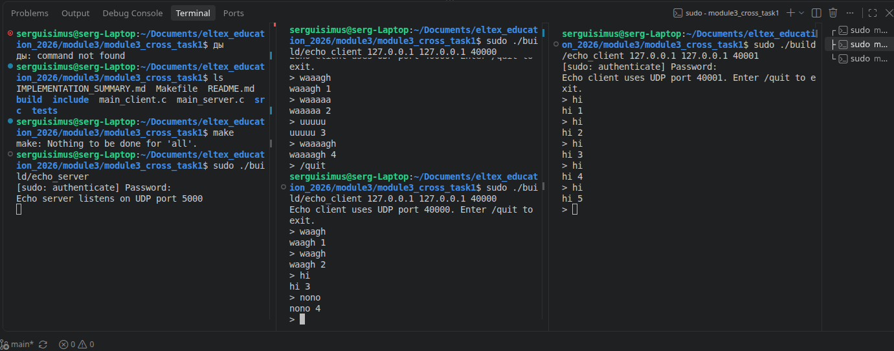

# Формулировка задания 1 
#raw_sockets #САОД #signals

- Написать echo-client и echo-server на raw сокетах. 
- Сервер должен отвечать клиенту то же самое сообщение + порядковый номер
сообщения от этого клиента. 
- Протокол сообщения – UDP.

### Например:
```text
-> Клиент 1 посылает на сервер сообщение “WAAAAAAAGH”
-> Сервер отвечает клиенту 1 “WAAAAAAAGH 1”
-> Клиент 1 посылает серверу сообщение “ping”
-> Сервер отвечает клиенту 1 “ping 2”
-> Клиент 2 посылает серверу сообщение “ping”
-> Сервер отвечает клиенту 2 “ping 1”
-> Клиент 1 посылает на сервер сообщение “WAAAAAAAGH”
-> Сервер отвечает клиенту 1 “WAAAAAAAGH 3”
```
- При штатном выключении (в том числе при получении сигнала) клиент
должен посылать серверу сообщение о закрытии, после получения этого
сообщения сервер должен сбросить связанные с данным клиентом счетчики
и при последующем подключении клиента с тем же ip:port, начинать
отсчет с 1.

## Отчёт по работе:

### пример работы на одном пк:
Запуск сервера:
```bash
sudo ./build/echo_server
```
Запуск клиента:
```bash
sudo ./build/echo_client 127.0.0.1 127.0.0.1 40000
```
Используется loopback-сценарий:
```bash
1: lo: <LOOPBACK,UP,LOWER_UP> mtu 65536 qdisc noqueue state UNKNOWN group default qlen 1000
    inet 127.0.0.1/8 scope host lo
       valid_lft forever preferred_lft forever
```



### Проверка на 2х ПК
на ПК выступающем в роли сервера:

```bash
sudo ./build/echo_server
```
в другом терминале(чтобы отследить прием/отправку пакетов):
```bash
sudo tcpdump -ni wlo1 -vv -X 'udp port 5000'
```

клиент на другом пк:
```bash
sudo ./build/echo_client 192.168.0.170 192.168.0.162 40000
```