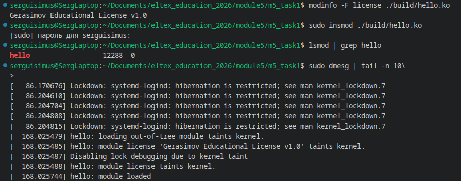
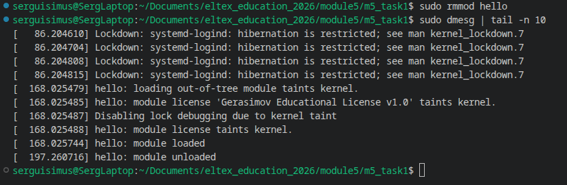

# Задание 1 по модулю 5

## Условия задания

- Написать модуль ядра Hello World для своей версии ядра.
- Изменить описание модуля, добавить себя как автора и придумать свою лицензию.
- Опубликовать результат в общедоступном Git-репозитории и отправить ссылку преподавателю.
- Приложить скриншоты запуска модуля.

## Окружение

Версия запущенного ядра:

```bash
$ uname -r
7.1.9-200.fc44.x86_64
```

Проверка наличия дерева сборки и заголовочных файлов для текущего ядра:

```bash
$ ls /lib/modules/$(uname -r)/build
arch   certs   Documentation  fs       init      ipc      kernel  Makefile          mm              net   samples  security  System.map  usr   vmlinux.h
block  crypto  drivers        include  io_uring  Kconfig  lib     Makefile.rhelver  Module.symvers  rust  scripts  sound     tools       virt  vmlinux.id
```

## Реализация

Вместо `printk(KERN_INFO ...)` использовал `pr_info()`. `pr_info()`
является обёрткой над `printk()` с уровнем журнала `KERN_INFO` и дополнительно
применяет `pr_fmt()` к строке формата:

```c
#define pr_info(fmt, ...) \
	printk(KERN_INFO pr_fmt(fmt), ##__VA_ARGS__)
```

Соответственно, при загрузке и выгрузке модуль записывает в журнал ядра
следующие сообщения:

```text
hello: module loaded
hello: module unloaded
```

Исходный код — [`hello.c`](hello.c), параметры сборки — [`Makefile`](Makefile),
полный текст собственной лицензии — [`LICENSE`](LICENSE).

## Сборка
```bash
$ make
```
Основной результат:
```text
build/hello.ko
```
Очистка результатов сборки:
```bash
$ make clean
```

## Информация о собранном модуле

```text
$ modinfo ./build/hello.ko
filename:       /home/serguisimus/Documents/eltex_education_2026/05-linux-kernel-modules/01-hello-kernel-module/build/hello.ko
description:    Hello World kernel module for Eltex module 5 task 1
author:         Gerasimov Sergei Mikhailovich <se.gerasimov.m@gmail.com>
license:        Gerasimov Educational License v1.0
depends:
name:           hello
retpoline:      Y
vermagic:       7.1.9-200.fc44.x86_64 SMP preempt mod_unload
```

## Подпись модуля при включённом Secure Boot

При включённом Secure Boot ядро Fedora отклоняет модули без доверенной
криптографической подписи. Поэтому для подписи был создан собственный ключ, а его публичная
часть была зарегистрирована через MOK (Machine Owner Key).

### Создание ключа

```bash
$ mkdir -p ~/.local/share/kernel-module-signing
$ chmod 700 ~/.local/share/kernel-module-signing

$ openssl req -new -x509 -newkey rsa:4096 \
    -keyout ~/.local/share/kernel-module-signing/MOK.priv \
    -outform DER \
    -out ~/.local/share/kernel-module-signing/MOK.der \
    -noenc \
    -days 3650 \
    -subj "/CN=Sergei Gerasimov Kernel Module Signing/"

$ chmod 600 ~/.local/share/kernel-module-signing/MOK.priv
```

### Регистрация публичного ключа

```bash
$ sudo mokutil --import \
    /home/serguisimus/.local/share/kernel-module-signing/MOK.der

$ sudo mokutil --list-new
```

После импорта необходимо было перезагрузить компьютер и подтвердить регистрацию в
MOK Manager.

На моём компьютере основным загрузчиком является rEFInd. Для однократного
запуска Fedora Shim использовал EFI-запись `Boot0002`:

```bash
$ efibootmgr
$ sudo efibootmgr --bootnext 0002
$ sudo reboot
```

Это относится только к моему ПК.

После регистрации ключ проверил командой:

```text
$ sudo mokutil --test-key \
    /home/serguisimus/.local/share/kernel-module-signing/MOK.der
/home/serguisimus/.local/share/kernel-module-signing/MOK.der is already enrolled
```

### Подписание модуля

**на fedora**
```bash
$ /lib/modules/$(uname -r)/build/scripts/sign-file \
    sha512 \
    ~/.local/share/kernel-module-signing/MOK.priv \
    ~/.local/share/kernel-module-signing/MOK.der \
    ./build/hello.ko
```
**на Kubuntu:** (я  начиная со второго задания, выполенял их под ubuntu)
```bash
/lib/modules/$(uname -r)/build/scripts/sign-file \
    sha512 \
    ~/.local/share/module-signing/MOK.priv \
    ~/.local/share/module-signing/MOK.der \
    ./build/hello.ko
```

Проверка подписи:

```text
$ modinfo ./build/hello.ko | grep -E 'signer|sig_key|sig_hashalgo'
signer:         Sergei Gerasimov Kernel Module Signing
sig_key:        ---
sig_hashalgo:   sha512
```

После каждой повторной сборки создаётся новый `hello.ko`, поэтому его необходимо
подписать заново.

## Загрузка и выгрузка модуля
```bash
$ sudo insmod ./build/hello.ko
$ lsmod | grep hello
$ sudo dmesg | tail -n 5
```



на ubuntu:
```bash
modinfo ./build/hello.ko | grep -E 'signer|sig_key|sig_hashalgo'

sudo insmod ./build/hello.ko
sudo dmesg | tail -n 5
```


```bash
$ sudo rmmod hello
$ sudo dmesg | tail -n 10
```



## Состояние `tainted`

- Модуль собран отдельно от дерева исходного кода ядра, поэтому считается
внешним (`out-of-tree`). 
- Придуманная лицензия `Gerasimov Educational License v1.0` не входит в список известных ядру
GPL-совместимых лицензий. Поэтому при загрузке модуль поэтому помечает текущее
запущенное ядро как `tainted`:

```text
hello: loading out-of-tree module taints kernel.
hello: module license 'Gerasimov Educational License v1.0' taints kernel.
```

Эти сообщения видны в журнале (на изображениях выше).

Текущее состояние также доступно в `/proc`:
```bash
$ cat /proc/sys/kernel/tainted
4097
```

Значение является битовой маской. В данном случае `4097 = 1 + 4096`:

- `1` (`P`) — был загружен модуль с неизвестной ядру GPL-совместимой лицензией;
- `4096` (`O`) — был загружен внешний (`out-of-tree`) модуль.


## Дополнительные материалы

- [Пример модуля ядра](https://www.thegeekstuff.com/2013/07/write-linux-kernel-module/)
- [Tainted kernels — Linux Kernel documentation](https://docs.kernel.org/admin-guide/tainted-kernels.html).
- [GNU Make 3.79 — руководство](http://rus-linux.net/nlib.php?name=/MyLDP/algol/gnu_make/gnu_make_3-79_russian_manual.html)
- [Модули ядра Linux](http://rus-linux.net/MyLDP/BOOKS/Moduli-yadra-Linux/kern-mod-index.html)
- [Linux Kernel Module Programming Guide](http://rus-linux.net/MyLDP/BOOKS/lkmpg.html)
- [Linux Device Drivers, Third Edition](http://dmilvdv.narod.ru/Translate/LDD3/index.html)
- [Карта ядра Linux](https://makelinux.github.io/kernel/map/)
- [Видео 1](https://zen.yandex.ru/video/watch/6269475f3103ec27fc9d4cc4)
- [Видео 2](https://zen.yandex.ru/video/watch/626950247ade6f2413b437d5)
- [Видео 3](https://zen.yandex.ru/video/watch/626be42198f1253f540b94dc)
- [Видео 4](https://zen.yandex.ru/video/watch/626bedd2ba47ce370123b73c)
