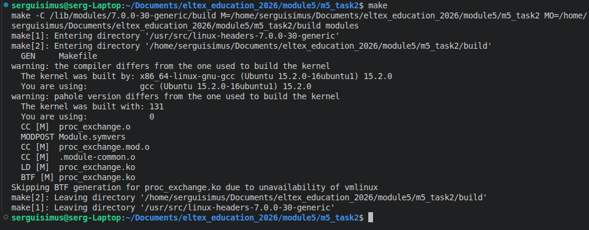
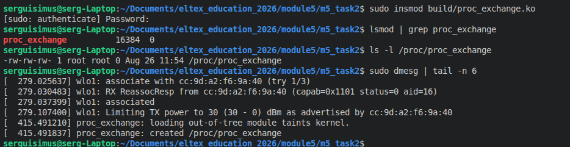
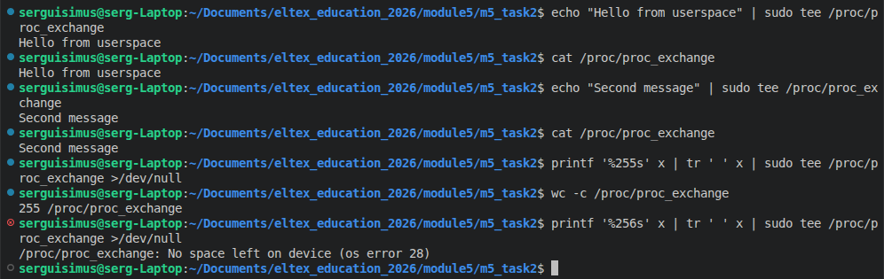
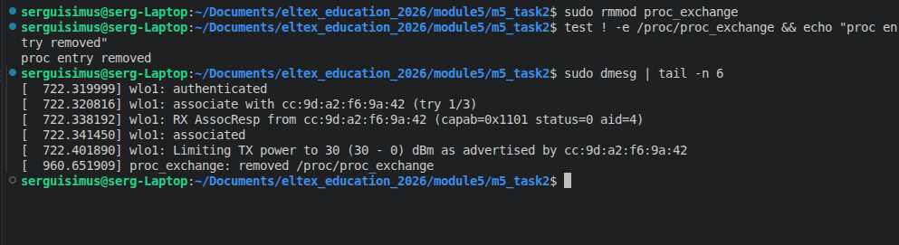

# Задание 2 по модулю 5 
- Написать модуль ядра для своей версии ядра, 
который будет обмениваться информацией с userspace через proc. 
- Адаптировать для своей версии ядра (Структура обработчиков). 
- Избавиться от харкода (маг чисел) и изолировать переменные модуля (static). 
- Результаты выложить на github или др. общедоступный git. 
- Cсылку на git выслать в ЛС для проверки. Скрины запуска, работы и тестирования работы модуля прилагаем.
---
- Пример модуля ядра 4.15 на proc https://pastebin.com/HhYmGSAM 
- Пример модуля ядра 5 https://pastebin.com/EfaYWKNL

---
#### Небольшой гайд для тех, кто пользуется VScode и хочет быстро смотреть исходнихи header-файлов
https://github.com/chek1337/Guide

---

### демонстрация выполнения задания:

```bash
serguisimus@serg-Laptop:~/Documents/eltex_education_2026$ uname -r
7.0.0-30-generic
serguisimus@serg-Laptop:~/Documents/eltex_education_2026$ uname -m
x86_64
serguisimus@serg-Laptop:~/Documents/eltex_education_2026$ gcc --version
gcc (Ubuntu 15.2.0-16ubuntu1) 15.2.0
Copyright (C) 2025 Free Software Foundation, Inc.
This is free software; see the source for copying conditions.  There is NO
warranty; not even for MERCHANTABILITY or FITNESS FOR A PARTICULAR PURPOSE.
```
## Сборка



## Загрузка модуля
```bash
sudo insmod build/proc_exchange.ko
lsmod | grep proc_exchange
ls -l /proc/proc_exchange
sudo dmesg | tail -n 10
```


## Работа и тестирование модуля
```bash
echo "Hello from userspace" | sudo tee /proc/proc_exchange
cat /proc/proc_exchange
...
```


## Выгрузка модуля
```bash
sudo rmmod proc_exchange
test ! -e /proc/proc_exchange && echo "proc entry removed"
sudo dmesg | tail -n 6
```

