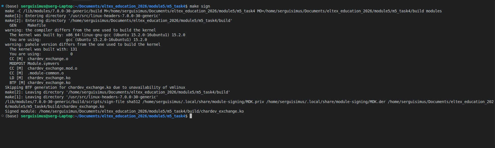
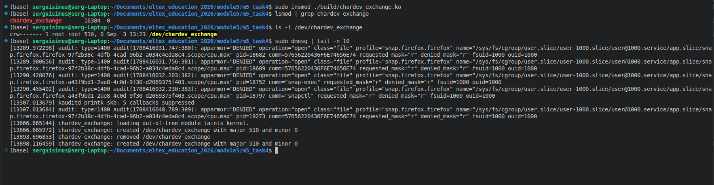
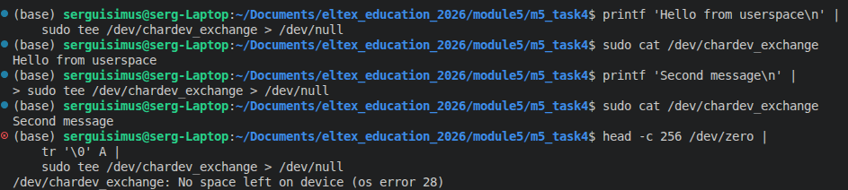
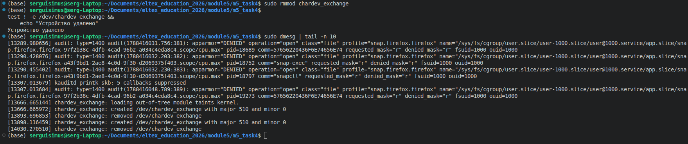

# Задание 4 по модулю 5: 
- Написать модуль ядра для своей версии ядра, который будет обмениваться информацией 
с userspace через chardev. 
- Результаты выложить на github или др. общедоступный git. Cсылку на git выслать в ЛС для проверки.

> Пример кода: https://pastebin.com/EDFLWM3m

## Вспомогательные материалы:
- Предварительно прочитав главу 3 и 4 http://rus-linux.net/MyLDP/BOOKS/lkmpg.html
- Еще документация https://linux-kernel-labs.github.io/refs/heads/master/labs/device_drivers.html
- Пример где есть write https://appusajeev.wordpress.com/2011/06/18/writing-a-linux-character-device-driver/

### Сборка и подпись

### Загрузка модуля

### Обмен информацией

### Выгрузка модуля

