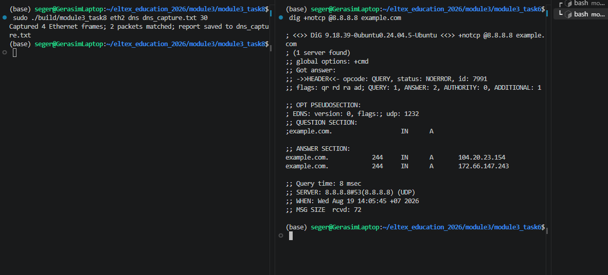
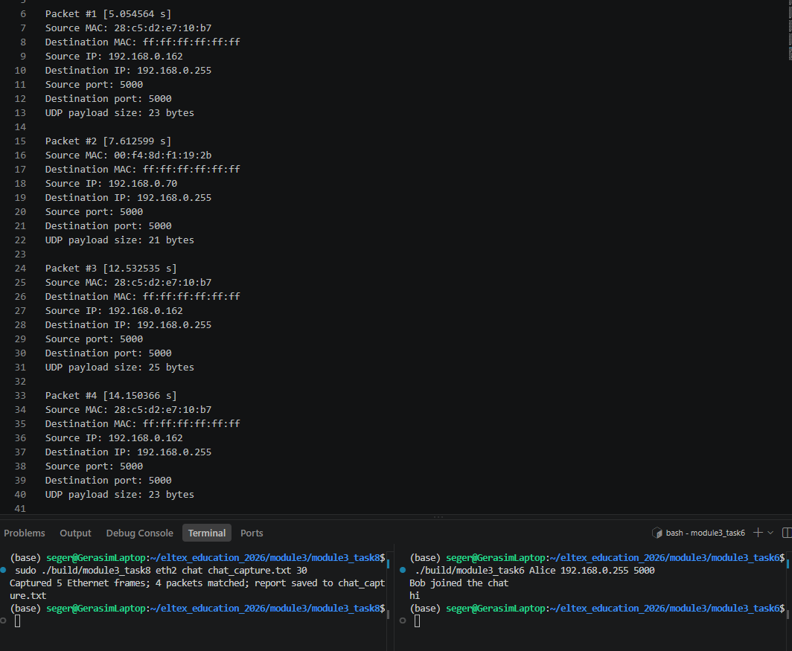
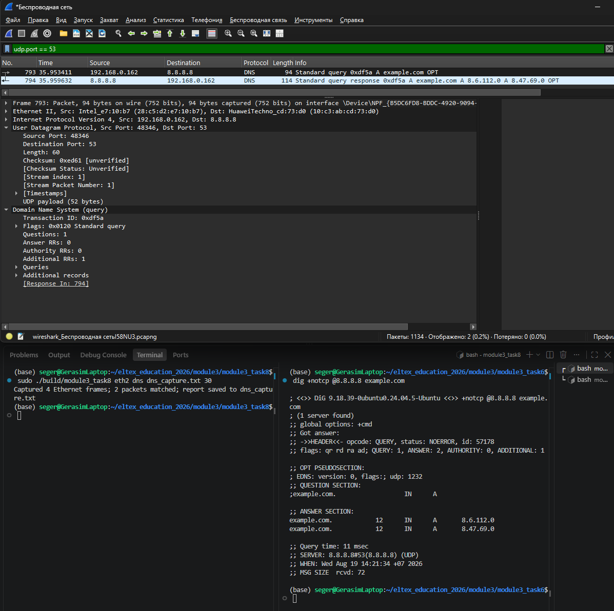
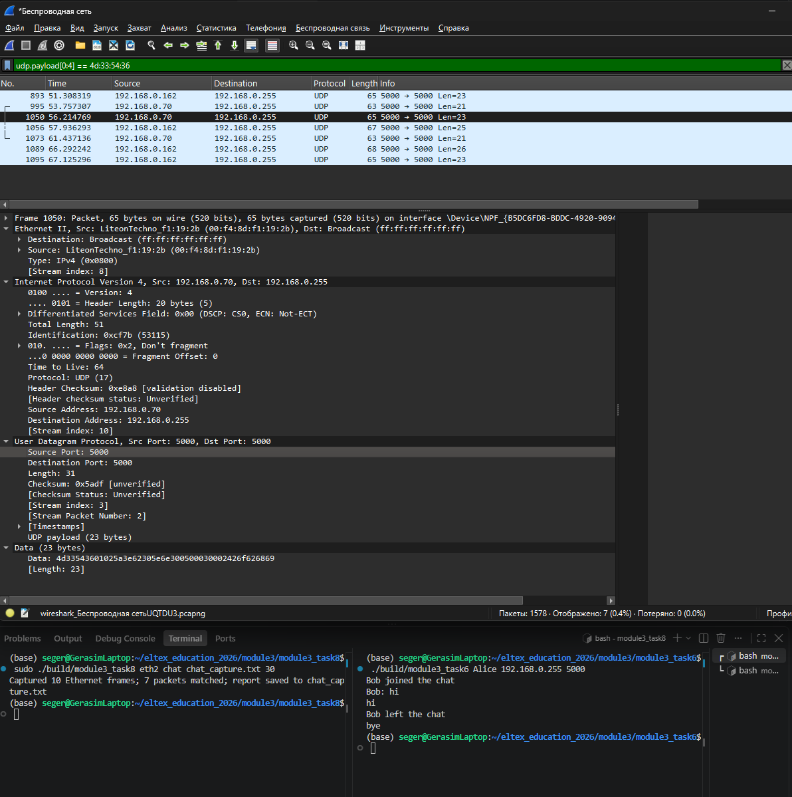

# Формулировка задания 8 
#UDP #RAW #сокеты

- Написать программу, получающую копии UDP сегментов.
- Добавить в программу не менее двух способов фильтрации полученных
данных: 
    - обязательно фильтр для сообщений, пересылаемых процессами из
задачи 6 
    - и как минимум один фильтр для перехвата данных других приложений (например, сообщений по протоколу DNS через UDP).
- Пользователь выбирает фильтр, который хочет использовать и
запускает сеанс захвата сегментов. 
- По окончании захвата собранные данные
выводятся на экран и/или сохраняются в файл в человекочитаемом виде.
- Информация, которая обязательно должна выводиться: время с момента
начала захвата пакетов, MAC адреса отправителя и получателя, IP адреса
отправителя и получателя, номера UDP портов отправителя и получателя.
- Для подтверждения корректности работы программы необходимо
сделать отчет со скриншотами из wireshark и результатами работы
программы – должны отображаться одинаковые сегменты.

## Сборка

```bash
make
```

Исполняемый файл: `build/module3_task8`.

## Запуск

```bash
sudo ./build/module3_task8 <интерфейс> <chat|dns> <имя_файла> [длительность_в_секундах]
```

Отчёт сохраняется в каталоге `captures/`. Если длительность не указана или равна `0`, захват завершается по `Ctrl+C`.

## Примечание о DNS-фильтре

DNS (Domain Name System, система доменных имён) использует стандартный серверный порт `53`. Поэтому фильтр DNS должен учитывать UDP-пакеты,
у которых порт отправителя или порт получателя равен `53`: в запросе портом назначения является порт DNS-сервера, а в ответе порт `53` становится
портом отправителя.

Использование UDP-порта `53` для DNS определено в разделе 4.2.1 стандарта
[RFC 1035 — Domain Names: Implementation and Specification](https://www.rfc-editor.org/rfc/rfc1035.html#section-4.2.1).

## Отчёт

### Проверка DNS-фильтра



*Рисунок 1 — Запуск захвата на интерфейсе `eth2` с DNS-фильтром и выполнение запроса `dig +notcp @8.8.8.8 example.com`. Программа перехватила два соответствующих пакета: DNS-запрос и DNS-ответ.*

### Проверка фильтра чата



*Рисунок 2 — Запуск захвата на интерфейсе `eth2` с фильтром `chat`, обмен сообщениями между участниками задания 6 и содержимое сформированного отчёта. Перехвачены четыре широковещательных UDP-пакета протокола чата.*


### Сравнение DNS-захвата с Wireshark

Результат программы для DNS-запроса и ответа:

```text
Packet #1 [3.908243 s]
Source MAC: 28:c5:d2:e7:10:b7
Destination MAC: 10:c3:ab:cd:73:d0
Source IP: 192.168.0.162
Destination IP: 8.8.8.8
Source port: 48346
Destination port: 53
UDP payload size: 52 bytes

Packet #2 [3.915032 s]
Source MAC: 10:c3:ab:cd:73:d0
Destination MAC: 28:c5:d2:e7:10:b7
Source IP: 8.8.8.8
Destination IP: 192.168.0.162
Source port: 53
Destination port: 48346
UDP payload size: 72 bytes
```



*Рисунок 3 — Одновременный захват DNS-трафика программой и Wireshark с фильтром `udp.port == 53`. В обоих результатах присутствуют один запрос к `8.8.8.8` и один ответ с совпадающими MAC-адресами, IP-адресами, UDP-портами `48346` и `53`, а также размерами UDP payload `52` и `72` байта.*

### Сравнение захвата чата с Wireshark

Программа перехватила семь сообщений протокола чата с размерами UDP payload `23`, `21`, `23`, `25`, `21`, `26` и `23` байта.

```text
Capture session
Interface: eth2
Filter: chat
Duration: 30 seconds

Packet #1 [1.693680 s]
Source MAC: 28:c5:d2:e7:10:b7
Destination MAC: ff:ff:ff:ff:ff:ff
Source IP: 192.168.0.162
Destination IP: 192.168.0.255
Source port: 5000
Destination port: 5000
UDP payload size: 23 bytes

Packet #2 [4.146358 s]
Source MAC: 00:f4:8d:f1:19:2b
Destination MAC: ff:ff:ff:ff:ff:ff
Source IP: 192.168.0.70
Destination IP: 192.168.0.255
Source port: 5000
Destination port: 5000
UDP payload size: 21 bytes

Packet #3 [6.604712 s]
Source MAC: 00:f4:8d:f1:19:2b
Destination MAC: ff:ff:ff:ff:ff:ff
Source IP: 192.168.0.70
Destination IP: 192.168.0.255
Source port: 5000
Destination port: 5000
UDP payload size: 23 bytes

Packet #4 [8.325810 s]
Source MAC: 28:c5:d2:e7:10:b7
Destination MAC: ff:ff:ff:ff:ff:ff
Source IP: 192.168.0.162
Destination IP: 192.168.0.255
Source port: 5000
Destination port: 5000
UDP payload size: 25 bytes

Packet #5 [11.825335 s]
Source MAC: 00:f4:8d:f1:19:2b
Destination MAC: ff:ff:ff:ff:ff:ff
Source IP: 192.168.0.70
Destination IP: 192.168.0.255
Source port: 5000
Destination port: 5000
UDP payload size: 21 bytes

Packet #6 [16.681027 s]
Source MAC: 28:c5:d2:e7:10:b7
Destination MAC: ff:ff:ff:ff:ff:ff
Source IP: 192.168.0.162
Destination IP: 192.168.0.255
Source port: 5000
Destination port: 5000
UDP payload size: 26 bytes

Packet #7 [17.513038 s]
Source MAC: 28:c5:d2:e7:10:b7
Destination MAC: ff:ff:ff:ff:ff:ff
Source IP: 192.168.0.162
Destination IP: 192.168.0.255
Source port: 5000
Destination port: 5000
UDP payload size: 23 bytes

Capture summary
Elapsed: 30.043 seconds
Ethernet frames received: 10
UDP datagrams parsed: 7
Packets matched by filter: 7
Unsupported frames: 3
Fragmented IPv4 packets: 0
Malformed frames: 0
Stopped by: timer
```



*Рисунок 4 — Одновременный захват трафика задания 6 программой и Wireshark с фильтром `udp.payload[0:4] == 4d:33:54:36`. В обоих результатах присутствуют семь широковещательных пакетов между узлами `192.168.0.162` и `192.168.0.70`: адрес назначения `192.168.0.255`, MAC-адрес назначения `ff:ff:ff:ff:ff:ff`, порты отправителя и получателя `5000`, а также размеры UDP payload полностью совпадают.*
