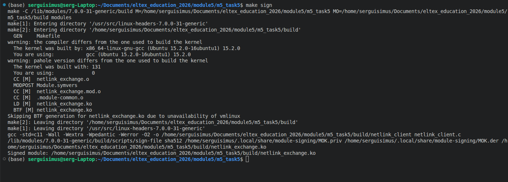
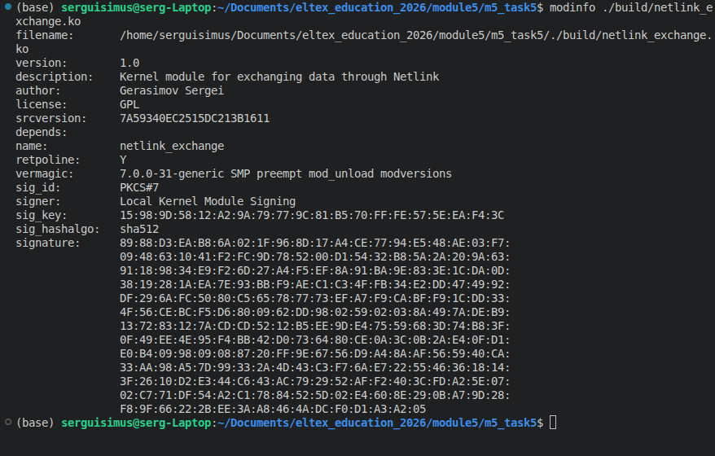
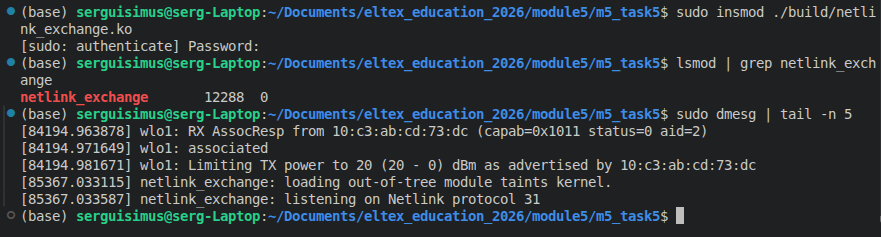
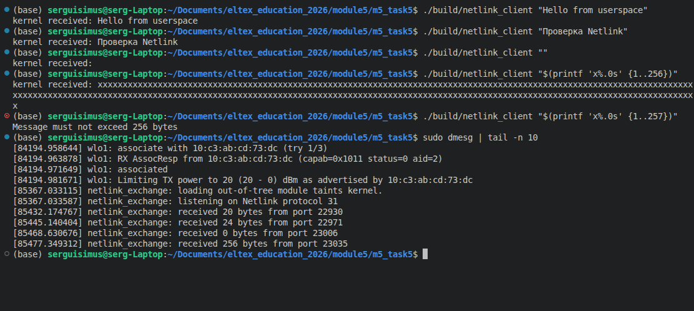
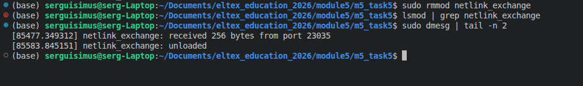

# Задание 5 по модулю 5: 
- Написать модуль ядра для своей версии ядра, который будет обмениваться информацией с userspace через netlink. 
- Результаты выложить на github или др. общедоступный git. Cсылку на git выслать в ЛС для проверки.

> Пример кода: https://stackoverflow.com/questions/27755246/netlink-socket-creation-returns-null

## Вспомогательные материалы:
- https://habr.com/ru/articles/121254/
- https://www.kernel.org/doc./html/latest/userspace-api/netlink/index.html
- https://www.yaroslavps.com/ru/weblog/genl-intro/

---

Все лекции тут - https://dzen.ru/id/626946f5f545a13bf77e96eb

---

## Реализация

- Модуль `netlink_exchange` создаёт сокет Netlink с номером протокола
`31`. 
- `netlink_client` отправляет модулю текст длиной до 256 байт,
а модуль возвращает ответ с префиксом `kernel received:`. 
- Номер порта отправителя берётся из служебных данных ядра, длина каждого пакета проверяется.


Протокол `31` не закреплён за стандартной подсистемой Linux и в теории должен подходить для локального модуля. Если его уже занял другой модуль, `insmod` завершится ошибкой.


Если такое происходит, то в текущей реализации нужно будет выбрать одинаковый свободный номер в `netlink_exchange.h` и пересобрать проект.

## Сборка

```bash
cd ~/Documents/eltex_education_2026/module5/m5_task5
make
```
Результаты в каталоге
`build`:

```bash
modinfo ./build/netlink_exchange.ko
file ./build/netlink_client
```

Очистка сборки:

```bash
make clean
```

## Подпись модуля
```bash
make sign
modinfo ./build/netlink_exchange.ko | grep -E 'signer|sig_key|sig_hashalgo'
```

## Загрузка модуля

```bash
sudo insmod ./build/netlink_exchange.ko
lsmod | grep netlink_exchange
sudo dmesg | tail -n 10
```

Для отправки сообщений права root не требуются, т.к. конфигурация
Netlink разрешает непривилегированным процессам посылать запросы нашему модулю.

## Обмен информацией

```bash
./build/netlink_client "Hello from userspace"
```

## Выгрузка модуля

```bash
sudo rmmod netlink_exchange
lsmod | grep netlink_exchange
sudo dmesg | tail -n 2
```

После выгрузки запуск клиента будет завершается ошибкой создания сокета, т.к. обработчик протокола `31` больше не зареган.

## Пример работы:

### сборка:



### загрука модуля



### работа модуля:


### выгрузка:

